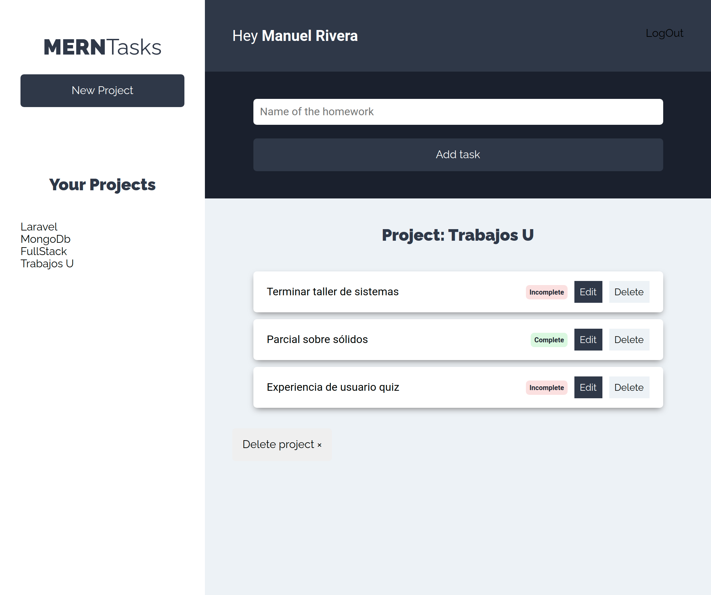

# MERNTasks

## Sitio

https://tasks-mern.herokuapp.com/

Administrador de proyectos y tareas creado con el stack MERN (Mongo Express React Node), autenticación con jwt, middleware de permisos,
sirviendo el frontend desde el backend y aplicando Server Side Rendering. Webpack para optimización y empaquetado de nuestro módulos.
El estado de la app se maneja con Context Api.

## Empezar 

* `yarn` para instalar dependencias.
* `yarn run dev` para levantar entorno de desarrollo.
* `yarn run build` generar el bundle.
* `yarn start` Correr en entorno de producción.
* `yarn run lint` Linter.

## Licencia

MIT

## Documentación API

https://documenter.getpostman.com/view/12344823/TVYC9KwY
